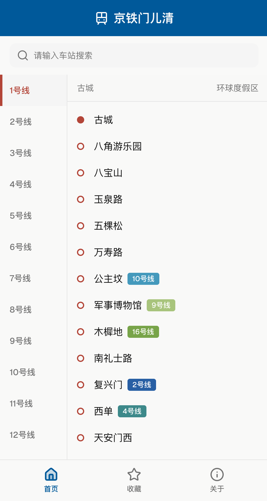
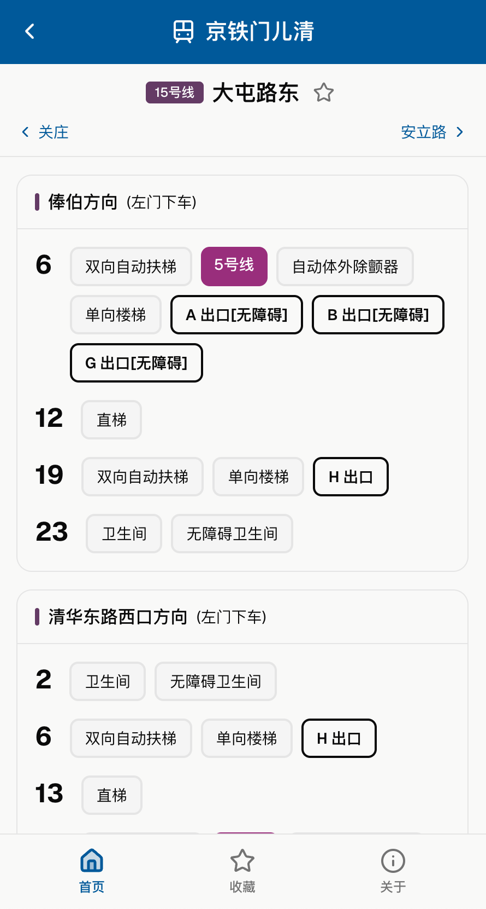

<div align="center">
  
  <h2>京铁门儿清</h2>
  <p><a href="https://bjs.pioet.top"><strong>🚀 立即体验</strong></a></p>
</div>

**京铁门儿清**是一款提供北京地铁站内设施信息的导航助手。通过精确到车门的对位指引，助您在复杂的车站中瞬时锁定换乘捷径、直达目标出口、秒寻应急设施。

<div align="center">
  
  
</div>

## 核心功能

### 1. 快：查询换乘捷径

精确标注每站换乘路线的最优车厢位置，确保您下车即是换乘通道或电梯，最大限度压缩站内步行距离，让早晚高峰换乘不再匆忙，快人一步。

### 2. 准：精准出站定位

提供各出口、进站口对应的最佳车厢编号，帮您提前在站台选好上车位置，做到"下车即出站"，彻底告别在站台反复确认地图、走回头路的烦恼。

### 3. 稳：应急与无障碍指引

详细标注站台内的自动体外除颤器（AED）、洗手间及直梯在哪个车门附近。无论是应对突发紧急状况，还是推婴儿车、携带大行李及残障人士出行，都能心中有数，稳妥前行。

## 数据说明

本项目的核心数据均存放于 [`data/`](./data/) 目录，结构如下：

```sh
data/
├── color.json        # 线路颜色配置
├── line.json         # 线路站点列表
├── transfer.json     # 换乘站信息
└── detail/           # 站点详细设施信息
    ├── 1号线.json
    ├── 2号线.json
    └ ...
```

### 数据来源

1. **站内设施：**[北京轨道交通乘换引导](assets/北京轨道交通乘换引导2601.pdf) —— 感谢@金安桥到平安里
2. **线路站点：**[高德地图 | 地铁图](https://map.amap.com/subway/index.html)

### 社区维护

本项目基础数据由机器自动化处理生成，难免存在信息误差或滞后。我们诚挚期待社区的长期参与，欢迎通过提交 Pull Request 或 Issue 协助校准数据细节，与我们共同打磨更精准的站内导航体验。

## 开源协议

本项目采用 [CC BY-NC-SA 4.0](https://creativecommons.org/licenses/by-nc-sa/4.0/) 协议开源。